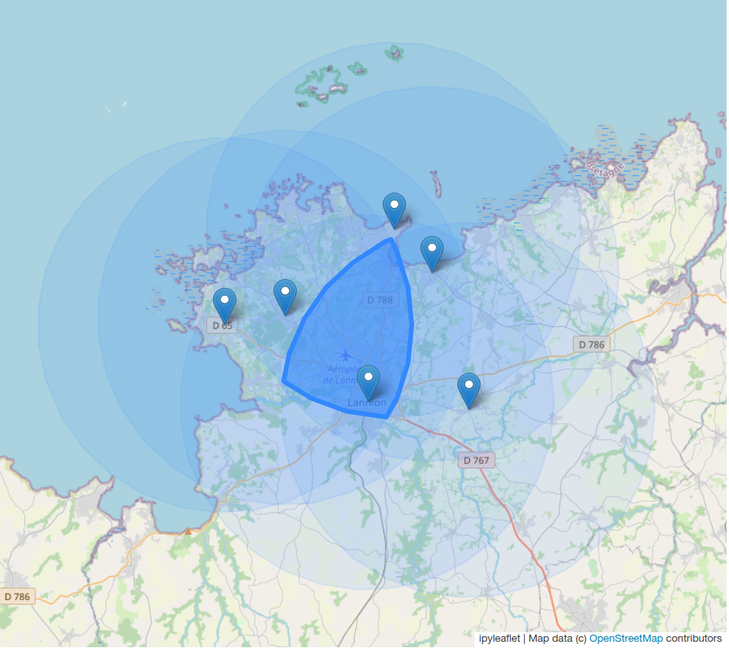

This jupyter notebook is used to display the intersections
between various circles.

Developed for Covid-19 lockdown N°3 for the 10 km limitation

# Requirements

## Python packages
- json: to open/read json files
- ipyleaflet: to display on map 
- ipywidgets: for map configuration
- shapely: for polygon operations
- geog: to compute polygon from center and radius
- numpy: required for geog

## Input file: points.geojson
- GeoJSON file to store a list of points (centre of the each zone)
- [Example](./points.geojson)

## Output file: zone.geojson
- GeoJSON file to store the interesction zone as a Polygon
- [Example](./zone.geojson)

# Limitations
## Hard-coded parameters:
- Radius: 10000m
- Number of points created for the circle: 32 points
- Opacity values to display on map

# Display

